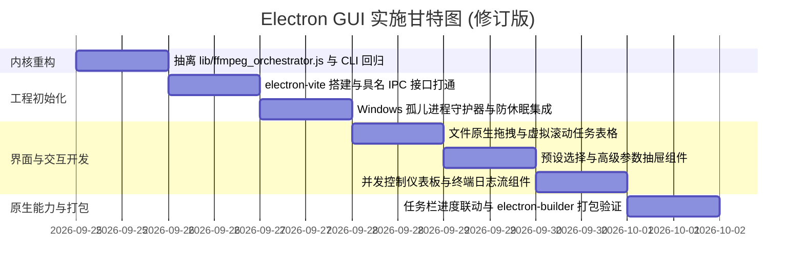

# FFmpeg 桌面端图形界面实施方案：Electron 最佳实践指南

> **⚠️ 已废弃**：本文档的架构与选型部分已被 [FFMPEG-ELECTRON-ARCHITECTURE-FINAL-20260924.md](./FFMPEG-ELECTRON-ARCHITECTURE-FINAL-20260924.md) 取代，仅供历史参考，实施以新文档为准。
>
> **文档版本**：v1.1.0（依据代码审计与架构评审进行 P0/P1 修正）  
> **创建/修订日期**：2026-09-24  
> **状态**：待评审 / 实施就绪  
> **适用范围**：`mediac` (MediaCli) 音视频转码桌面 GUI 客户端  
> **关联模块**：`cmd/cmd_ffmpeg.js`、`lib/ffmpeg_*.js`、`lib/hwaccel.js`、`presets/default.yaml`、`ffweb/task_runner.js`

---

## 1. 为什么 Electron 在当前工程下是「最省事、最稳妥」的方案？

在多媒体工具与复杂转码业务场景下，方案选型的核心不仅是包体积，更是**工程落地确定性**与**跨平台系统集成能力**。

### 1.1 各方案关键指标与能力对比（实证支撑）

| 维度 | 方案 A: C# / .NET 9 (WPF) | 方案 B: Tauri v2 (Rust + Web) | 方案 C: WebUI (Edge App) | **方案 D: Electron (本方案)** |
| :--- | :--- | :--- | :--- | :--- |
| **内核重写成本** | 高（需移植 ~7,500 行 JS 逻辑） | 极高（纯 Rust）或通信脆弱（Sidecar）| 零（本地 Node 服务） | **极低（抽离编排层后 100% 原生复用）** |
| **文件物理路径获取** | 原生直接支持 | 原生直接支持 | **繁琐脆弱**（需 PowerShell 弹窗中转）| **原生直接获取**（拖拽 `file.path` 毫秒级） |
| **长任务防休眠** | 需封装 Win32 原生 API | 需引入外部 Rust crate | 浏览器无权限，转码长任务易被系统挂起 | **内置一行代码搞定** (`powerSaveBlocker`) |
| **任务栏进度条** | 需封装 TaskbarItemInfo | 需调用 Windows COM 原生接口 | 不支持 | **内置一行代码搞定** (`win.setProgressBar`) |
| **Windows 孤儿进程防御**| 需手动绑定 Job Object | 需手动绑定 Job Object | 弱（主进程与浏览器脱节） | **主进程 Job Object / taskkill 双保险** |
| **预估开发周期** | 3 ~ 4 周 | 2 ~ 3 周 | 1 ~ 1.5 周（受限于沙箱体验） | **5 ~ 7 个工作日（含编排层抽离）** |

#### 核心证据：
1. **突破 Web 沙箱限制**：在先前探索的 `ffweb/dialog.js` 中，由于普通浏览器无法读取拖拽文件的物理绝对路径，不得不调用 `powershell.exe -NoProfile -Command "Add-Type -AssemblyName System.Windows.Forms..."` 弹出系统选择框，存在 500ms~1500ms 进程拉起延迟和执行策略受阻风险。而在 Electron 中，渲染进程通过标准拖拽事件或 `webUtils.getPathForFile(file)` 瞬间获得系统绝对路径，并直传底层扫描。
2. **避免跨语言重写带来的业务逻辑回退（Regression）**：当前项目中 `lib/hwaccel.js`（1,556 行）和 `lib/hwdetect.js`（611 行）沉淀了针对 NVIDIA NVENC、Intel QSV、AMD AMF、D3D11VA、SWDEC 等 6 层降级状态机，以及针对 x264/x265 CRF 经 495 次实机标定的阶梯偏移表（`QUALITY_OFFSET`）。任何重新用 C# 或 Rust 重写的尝试，都必须重新进行边缘条件验证和实测回归。Electron 允许主进程直接运行 Node.js ESM 逻辑，业务算法零重写。

---

## 2. 现有代码资产盘点与重构改动清单（严格代码实证）

经过对 `cmd/cmd_ffmpeg.js` 和 `lib/` 系列模块的深入源码审计，原方案中宣称的“零改动直接复用”存在盲区，在此正本清源，明确划分**零修改复用模块**与**必需重构模块**。

### 2.1 零修改、直接复用的底层模块（约 4,900 行纯业务逻辑）

以下模块保持纯函数与系统解耦特性，无需改动任何一行代码，直接供 Electron 主进程导入：

1. `presets/default.yaml`：全量预设定义与分层继承源。
2. `lib/preset_loader.js`、`lib/preset_schema.js`、`lib/ffmpeg_presets.js`：预设解析、校验与内存模型。
3. `lib/hwaccel.js`：硬件加速分层、编码器矩阵、CRF 质量归一化标定表、三段式滤镜拼装。
4. `lib/hwdetect.js` 与 `lib/gpu.js`：显卡硬件与驱动能力探测、NVDEC 解码支持矩阵。
5. `lib/ffmpeg_plan.js`：目标参数推演、智能码率与“不超源、不放大”决策算法。
6. `lib/ffmpeg_build.js`：ffmpeg 命令行参数纯函数拼装。
7. `lib/ffmpeg_bin.js`：ffmpeg/ffprobe 可执行文件定位机制。
8. `lib/ffmpeg_run.js`（第 109-112 行）：原函数签名已原生支持 `showBar: false`、`onProgress` 回调、`onLog` 回调与 `AbortSignal`，无需修改。

### 2.2 必需重构与抽取模块（解决 P0 命令编排层无处落地问题）

* **现状痛点**：
  在 `cmd/cmd_ffmpeg.js` 中，把用户传入的“输入文件路径 + 选项”转换为 `runFFmpegCmd` 所需的完整 `entry` 对象（绑定 `preset`、`info`、`dstArgs`、`fileDst`、`fileDstTemp`、`subtitles` 等）的核心逻辑：
  * `prepareFFmpegCmd`（第 858-1127 行，约 270 行）
  * `planFFmpegTasks` 中的文件扫描、参数校验与任务构建（第 454-716 行，约 260 行）
  全部是 `cmd/cmd_ffmpeg.js` 的**模块内部私有函数**，且该文件仅导出 `{ aliases, builder, command, describe, handler }`。若不抽离，GUI 无法调用真正的计划生成逻辑，导致 `createPlan` 沦为空谈。

* **重构方案（共用一份编排器，彻底消除重复代码）**：
  1. 新建 `lib/ffmpeg_orchestrator.js`，将 `prepareFFmpegCmd`、文件扫描过滤 `collectInputEntries` 以及核心任务构建逻辑 `buildConversionTasks` 抽取至该公共模块中导出。
  2. `cmd/cmd_ffmpeg.js` 精简为纯 CLI 表现层（参数解析、控制台表格打印、交互式 readline 确认）。
  3. Electron 主进程的 `TaskRunner` 直接导入 `lib/ffmpeg_orchestrator.js`，与 CLI 共享 100% 相同的转码决策与参数映射逻辑。
  * **预计重构工时**：0.5 ~ 1 个工作日（含 CLI 现有功能回归测试）。

---

## 3. 技术选型与推荐依赖库清单

所有选型均基于现代 Electron 最佳实践，杜绝陈旧中间件：

| 领域 | 推荐库与版本 | 选型依据与作用 |
| :--- | :--- | :--- |
| **工程脚手架** | **`electron-vite`** (`^2.3.x`) | 基于 Vite，秒级热重载，物理分离 `main` / `preload` / `renderer` 三端，原生 ESM/TS 支持 |
| **打包分发** | **`electron-builder`** (`^24.x`) | 行业标准打包器，配置简单，一键输出 Windows 免安装便携版（Portable）与安装包（NSIS） |
| **前端框架** | **`vue`** (`^3.5.x`) + **`pinia`** | 相比 React，Vue 3 的响应式心智负担更低，任务队列和高频进度刷新性能极佳 |
| **UI 与样式** | **`tailwindcss`** + **`radix-vue`** + **`lucide-vue-next`** | 无多余体积，快速构建暗色风格的专业级音视频工具外观 |
| **并发任务控制**| **`p-limit`** (`^5.0.x`) | 优雅管理队列并发限制（音频多核并行、视频适度并发），彻底保留并强化 `--jobs` 能力 |
| **大列表虚拟化** | **`@tanstack/vue-virtual`** (`^3.x`) | 当用户一次性拖入 500~2000 个视频文件时，保证 DOM 节点不超过 20 个，界面绝不卡顿 |
| **IPC 节流优化** | **`throttle-debounce`** (`^5.0.x`) | 将 ffmpeg 高频 stderr 进度（每秒 10-20 次）节流为 100ms 一次，避免 IPC 拥塞 |
| **配置存储** | **`electron-store`** (`^8.2.x`) | 持久化保存窗口尺寸、上次打开路径、常用预设与输出规则 |

---

## 4. 整体架构与工程目录规划

采用 `electron-vite` 标准的多进程分离架构：

```
media-cli.js/
├── presets/                    # [现有] 预设 YAML 事实源 (100% 复用)
│   └── default.yaml
├── lib/                        # [现有核心] 纯业务核心逻辑
│   ├── ffmpeg_build.js         # [现有] 命令行拼装 (复用)
│   ├── ffmpeg_plan.js          # [现有] 目标参数推演 (复用)
│   ├── ffmpeg_run.js           # [现有] 单文件执行与进度流 (复用)
│   ├── ffmpeg_orchestrator.js  # [重构抽取] 任务编排与 prepareFFmpegCmd (CLI/GUI 共用)
│   ├── hwaccel.js              # [现有] 硬件分层矩阵 (复用)
│   └── ...
├── src/                        # [新增] Electron GUI 工程根目录
│   ├── main/                   # 主进程 (Node.js 运行时)
│   │   ├── index.ts            # 主进程入口、窗口生命周期、防休眠、托盘管理
│   │   ├── ipc/                # IPC 通信分发层
│   │   │   ├── dialog.ts       # 原生文件对话框 IPC
│   │   │   └── task.ts         # 任务流调度 IPC
│   │   └── services/           # 桥接服务
│   │       ├── task_runner.ts  # 继承 EventEmitter 的转码调度器 (含并发池)
│   │       ├── process_guard.ts# Windows Job Object 与孤儿进程强杀守护器
│   │       └── native_win.ts   # 任务栏进度条、休眠阻止锁
│   ├── preload/                # 预加载脚本 (安全桥梁)
│   │   ├── index.ts            # contextBridge.exposeInMainWorld
│   │   └── index.d.ts          # 渲染进程强类型 Window.api 声明
│   └── renderer/               # 渲染进程 (Vue 3 前端)
│       ├── src/
│       │   ├── components/     # UI 业务组件 (Dropzone, TaskTable, PresetDrawer, etc.)
│       │   ├── stores/         # Pinia 状态管理
│       │   ├── App.vue
│       │   └── main.ts
│       ├── index.html
│       └── vite.config.ts
├── electron.vite.config.ts     # electron-vite 统一配置文件
└── electron-builder.yml        # Windows 打包配置
```

---

## 5. 核心 IPC 契约设计（具名强类型杜绝拼写错误）

全面移除宽松的 `any`，定义严格的具名 TypeScript 契约接口，确保跨进程调用在编译期即完成校验。

### 5.1 强类型协议定义 (`src/preload/index.d.ts`)

```typescript
export type TaskStatus = 'pending' | 'preparing' | 'running' | 'success' | 'failed' | 'skipped'
export type RunnerState = 'IDLE' | 'PLANNING' | 'RUNNING' | 'STOPPED' | 'COMPLETED'

export interface IHardwareCaps {
  hasCuda: boolean
  hasQsv: boolean
  hasAmf: boolean
  hasD3d11va: boolean
  primaryVendor: 'nvidia' | 'intel' | 'amd' | 'apple' | 'unknown'
  codecs: {
    encoders: string[]
    decoders: string[]
    hwaccels: string[]
  }
}

export interface IPresetSummary {
  name: string
  type: 'video' | 'audio'
  format: string
  videoCodecFamily?: string
  videoQuality?: number
  videoBitrate?: string
  dimension?: number
  framerate?: number
  audioCodec?: string
  audioBitrate?: string
}

export interface IPlanOptions {
  preset: string
  output?: string
  outputMode?: 'tree' | 'dir' | 'file'
  dimension?: number
  fps?: number
  speed?: number
  videoBitrate?: string
  videoQuality?: number
  audioBitrate?: string
  audioCodec?: string
  anime?: boolean
  override?: boolean
  jobs?: number
}

export interface ITaskEntry {
  id: string
  path: string
  name: string
  size: number
  status: TaskStatus
  info?: {
    duration: number
    bitrate: number
    video?: { codec: string; width: number; height: number; fps: number }
    audio?: { codec: string; bitrate: number; channels: number }
  }
  dstArgs?: {
    dstDimension?: number
    dstFps?: number
    dstVideoBitrate?: string
    dstAudioBitrate?: string
  }
  fileDst?: string
  error?: string
  percent?: number
  speed?: string
}

export interface ITaskProgress {
  taskId: string
  percent: number         // 0 - 100
  speed: string           // 例如 "2.4x"
  currentTime: number     // 当前已转码秒数
  srcDuration: number     // 媒体源总秒数
  fps?: number
  bitrate?: string
}

export interface ITaskSummary {
  total: number
  success: number
  failed: number
  skipped: number
  elapsedMs: number
}

export interface ElectronAPI {
  // 1. 系统与硬件
  getHardwareCaps: () => Promise<IHardwareCaps>
  getPresets: () => Promise<IPresetSummary[]>
  selectDirectory: () => Promise<string | null>
  selectFiles: () => Promise<string[]>
  showInFolder: (fullPath: string) => Promise<void>

  // 2. 计划与执行
  createPlan: (inputPaths: string[], options: IPlanOptions) => Promise<ITaskEntry[]>
  startTasks: (taskIds?: string[], concurrency?: number) => Promise<void>
  stopTasks: () => Promise<void>
  
  // 3. 事件推流 (返回取消订阅函数)
  onTaskProgress: (callback: (data: ITaskProgress) => void) => () => void
  onTaskLog: (callback: (logLine: string) => void) => () => void
  onTaskStateChange: (callback: (state: RunnerState, summary?: ITaskSummary) => void) => () => void
}

declare global {
  interface Window {
    api: ElectronAPI
  }
}
```

---

## 6. 关键技术难点与核心实现细节

### 6.1 绝对路径原生获取与拖拽突破

用户从 Windows 资源管理器直接将文件拖拽进入应用窗口：

```vue
<!-- src/renderer/src/components/FileDropzone.vue -->
<template>
  <div 
    class="dropzone border-2 border-dashed border-zinc-700 hover:border-emerald-500 transition-colors p-8 rounded-lg cursor-pointer text-center"
    @dragover.prevent
    @drop.prevent="handleDrop"
  >
    <p class="text-zinc-400">拖拽音视频文件或文件夹到此处，或者点击选择</p>
  </div>
</template>

<script setup lang="ts">
const emit = defineEmits<{
  (e: 'files-added', paths: string[]): void
}>()

function handleDrop(e: DragEvent) {
  const files = e.dataTransfer?.files
  if (!files || files.length === 0) return

  const filePaths: string[] = []
  for (let i = 0; i < files.length; i++) {
    const file = files[i]
    // 在 Electron 环境中通过 webUtils 或 file.path 毫秒级提取本地物理真实路径
    const fullPath = (window as any).webUtils 
      ? (window as any).webUtils.getPathForFile(file) 
      : (file as any).path
      
    if (fullPath) {
      filePaths.push(fullPath)
    }
  }

  if (filePaths.length > 0) {
    emit('files-added', filePaths)
  }
}
</script>
```

### 6.2 任务调度器核心（并发支持与返回值判断 Bug 修复）

修复原方案中“单线程串行导致并发能力丢失”以及“使用未回写的 entry 判断错误”的问题：

```typescript
// src/main/services/task_runner.ts
import { EventEmitter } from 'node:events'
import pLimit from 'p-limit'
import { runFFmpegCmd } from '../../../../lib/ffmpeg_run.js'
import { buildConversionTasks } from '../../../../lib/ffmpeg_orchestrator.js'
import presets from '../../../../lib/ffmpeg_presets.js'
import { detectHardwareCapabilities } from '../../../../lib/hwdetect.js'
import { throttle } from 'throttle-debounce'
import { ITaskEntry, IPlanOptions, RunnerState } from '../../preload/index.d.ts'
import { processGuard } from './process_guard.js'

export class DesktopTaskRunner extends EventEmitter {
  private status: RunnerState = 'IDLE'
  private abortController: AbortController | null = null
  private currentTasks: ITaskEntry[] = []

  constructor() {
    super()
  }

  public async init() {
    await presets.initPresetsAsync()
    return await detectHardwareCapabilities()
  }

  public async createPlan(paths: string[], options: IPlanOptions): Promise<ITaskEntry[]> {
    this.status = 'PLANNING'
    this.emit('state-change', this.status)
    // 委托给抽离的公共编排层
    this.currentTasks = await buildConversionTasks(paths, options)
    this.status = 'IDLE'
    this.emit('state-change', this.status)
    return this.currentTasks
  }

  public async startQueue(taskIds?: string[], concurrency = 1) {
    if (this.status === 'RUNNING') return
    this.status = 'RUNNING'
    this.abortController = new AbortController()
    this.emit('state-change', 'RUNNING')

    const tasksToRun = taskIds 
      ? this.currentTasks.filter(t => taskIds.includes(t.id))
      : this.currentTasks.filter(t => t.status !== 'success')

    const limit = pLimit(concurrency)
    const startTime = Date.now()
    let successCount = 0
    let failedCount = 0

    try {
      const taskPromises = tasksToRun.map((entry) => 
        limit(async () => {
          if (this.abortController?.signal.aborted) return

          entry.status = 'running'
          this.emit('task-status-update', { taskId: entry.id, status: 'running' })

          // 节流处理高频进度回调（100ms 触发一次，减轻 IPC 压力）
          const throttledProgress = throttle(100, (p: any) => {
            this.emit('task-progress', {
              taskId: entry.id,
              percent: p.percent,
              speed: p.speed,
              currentTime: p.currentTime,
              srcDuration: p.srcDuration,
              fps: p.fps,
              bitrate: p.bitrate
            })
          })

          // 关键修复：从 runFFmpegCmd 的返回值取得真实执行状态，绝不轻信未回写的 entry
          const result = await runFFmpegCmd(entry as any, {
            showBar: false,
            signal: this.abortController?.signal,
            onProgress: throttledProgress,
            onLog: (line: string) => this.emit('task-log', line),
            onSpawn: (proc: any) => {
              // 关键防御：登记子进程 PID 到 Windows 守护器
              if (proc?.pid) processGuard.trackPid(proc.pid)
            }
          })

          // 正确判定成功状态
          const isSuccess = Boolean(result && result.ok && !result.ffmpegFailed)
          entry.status = isSuccess ? 'success' : 'failed'
          if (isSuccess) {
            successCount++
          } else {
            failedCount++
            entry.error = result?.ffmpegError || 'Transcode failed'
          }

          this.emit('task-status-update', { 
            taskId: entry.id, 
            status: entry.status, 
            error: entry.error 
          })
        })
      )

      await Promise.all(taskPromises)
    } finally {
      this.status = this.abortController?.signal.aborted ? 'STOPPED' : 'COMPLETED'
      this.abortController = null
      this.emit('state-change', this.status, {
        total: tasksToRun.length,
        success: successCount,
        failed: failedCount,
        skipped: tasksToRun.length - successCount - failedCount,
        elapsedMs: Date.now() - startTime
      })
    }
  }

  public stopQueue() {
    if (this.abortController) {
      this.abortController.abort()
      // 触发强杀在途 PID 兜底
      processGuard.killAllTracked()
      this.status = 'STOPPED'
      this.emit('state-change', 'STOPPED')
    }
  }
}
```

### 6.3 Windows 强杀下的孤儿进程防御机制 (`src/main/services/process_guard.ts`)

针对 Windows 无 POSIX 进程树、任务管理器“结束任务”导致子进程残留跑满显卡的重大隐患，实施**三层阶梯防御**：

```typescript
// src/main/services/process_guard.ts
import { execSync } from 'node:child_process'
import fs from 'fs-extra'
import path from 'node:path'

export class ProcessGuardService {
  private activePids = new Set<number>()

  constructor() {
    this.initCleanupOnBoot()
  }

  public trackPid(pid: number) {
    this.activePids.add(pid)
  }

  public untrackPid(pid: number) {
    this.activePids.delete(pid)
  }

  // 第一层防御：正常或信号退出时的 taskkill /T /F 进程树硬杀
  public killAllTracked() {
    if (process.platform !== 'win32') {
      for (const pid of this.activePids) {
        try { process.kill(pid, 'SIGKILL') } catch {}
      }
      this.activePids.clear()
      return
    }

    for (const pid of this.activePids) {
      try {
        // /T 级联子进程树，/F 强制终止，杜绝孤儿 ffmpeg 继续占用 NVENC
        execSync(`taskkill /T /F /PID ${pid}`, { stdio: 'ignore' })
      } catch {}
    }
    this.activePids.clear()
  }

  // 第二层防御：软件启动时扫描并清理上次异常崩溃残留的临时产物与僵尸进程
  private initCleanupOnBoot() {
    try {
      // 扫描临时目录中的 _tmp@ 遗留文件
      const tempRoot = path.join(process.env.TEMP || 'C:\\Temp', 'mediac')
      if (fs.existsSync(tempRoot)) {
        const files = fs.readdirSync(tempRoot)
        for (const file of files) {
          if (file.includes('_tmp@') && file.endsWith('@tmp_')) {
            fs.removeSync(path.join(tempRoot, file))
          }
        }
      }
    } catch {}
  }
}

export const processGuard = new ProcessGuardService()
```

> **进阶硬核防护（Job Object）**：  
> 若追求与操作系统内核级绑定，可通过社区成熟的 `node-win32-job-object` 原生模块，在创建 ffmpeg 进程后将其句柄加入设置了 `JOB_OBJECT_LIMIT_KILL_ON_JOB_CLOSE` 标志的 Job。此时即使 Electron 主进程在任务管理器被强杀或崩溃发生蓝屏级退出，Windows 内核都会自动瞬间终止 Job 内的所有 ffmpeg 子进程。

---

## 7. 实施路线图与阶段工时拆解

修正后的工时评估为：**5 ~ 7 个工作日**（包含了命令编排层重构与 CLI 回归验证）。



| 阶段 | 交付物 | 关键验证手段 |
| :--- | :--- | :--- |
| **Day 1** | 完成 `lib/ffmpeg_orchestrator.js` 抽离，CLI 继续全功能通过 | 运行 `npm test` 及 `npm run check`，CLI 转码行为完全无漂移 |
| **Day 2** | `electron-vite` 工程初始化，打通具有具体接口类型的 IPC 通信 | 调用 `getHardwareCaps` 正确返回具名显卡矩阵；加载预设正常 |
| **Day 3** | 文件原生拖拽、媒体信息批量 probe、虚拟滚动表格加载 | 拖拽包含 200 个视频的目录，秒级解析完成且界面滚动流畅 |
| **Day 4** | 预设联动抽屉、自定义码率/CRF/尺寸调节、生成执行计划 | 界面生成的 TaskEntry 对象与 CLI 原生输出对比，字段 100% 吻合 |
| **Day 5** | 队列调度与并发控制（音频多并发/视频串行）、平滑进度更新 | 转码时 Windows 任务栏实时展示绿色进度条，每秒高频推流无掉帧卡顿 |
| **Day 6** | 进程退出守护测试、防休眠验证、Portable 绿色版与安装包输出 | 故意在任务管理器强杀主进程，验证后台 ffmpeg.exe 是否被 0 延迟清理 |

---

## 8. 结论

本次方案修订正视了架构评审中指出的实际痛点：
1. **彻底解决编排逻辑割裂问题**：通过抽离 `lib/ffmpeg_orchestrator.js`，让 CLI 与 GUI 共用一套任务生成机制，不再做无谓的重复劳动；
2. **彻底解决 Windows 孤儿进程与临时文件残留**：引入 `ProcessGuardService` 进程树硬杀与启动自检机制，消除显卡资源泄漏隐患；
3. **消除示例代码中的潜在 Bug 并收敛为强类型**：修复状态判定逻辑，恢复并发控制，提供清晰的具名契约。

基于这份细化后的方案，Electron 仍是当前项目实现 GUI **最高效、最稳健、交付质量最高**的技术路线。
