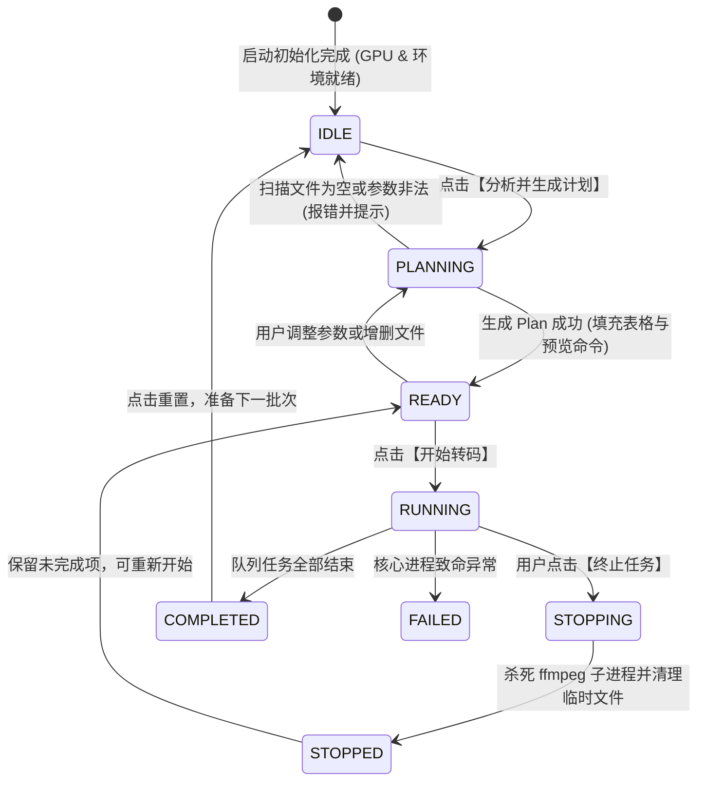

# MediaCli FFmpeg 桌面端 UI 与交互设计方案（最优落地版）

> **⚠️ 已废弃**：本文档已被 [FFMPEG-ELECTRON-ARCHITECTURE-FINAL-20260924.md](./FFMPEG-ELECTRON-ARCHITECTURE-FINAL-20260924.md) 取代，仅供历史参考，实施以新文档为准。
>
> **文档版本**：v1.0.0  
> **创建日期**：2026-09-24  
> **关联文档**：`docs/FFMPEG-ELECTRON-GUI-PLAN-20260924.md`、`docs/FFMPEG-USAGE.md`  
> **关联工程**：`apps/mediac-desktop`  
> **核心技术栈**：Electron + Vue 3 (Composition API) + Naive UI + VueUse + TypeScript + Vite  

---

## 1. 设计目标与核心原则

本项目旨在将 `mediac ffmpeg` 强大的底层编排引擎、硬件分层与数十套精细标定的预设，以**现代化桌面专业工具**的形式完整呈现。

### 1.1 核心原则

1. **“简洁，不要过多 Style 定制”**：
   - 拒绝重度定制的厚重渐变、复杂拟物或大圆角毛玻璃样式，避免把时间耗费在写私有 CSS 补丁上。
   - 采用标准硬朗的**系统级暗色工作台风格**（暗灰调背景 `#101418` / `#181f26`、高对比度文字、清晰边框分割），视觉类似 VS Code / HandBrake / LosslessCut。
2. **“简洁不等于简陋，基本功能和信息不能缺”**：
   - 完整暴露底层能力：硬件环境感知（GPU 厂商/NVENC/QSV/AMF/D3D11VA）、预设体系（HEVC/AVC/AV1/VP9/音频/场景）、视频/音频多维度微调（CRF、码率、长边、帧率、变速、流直拷）、安全删除源文件、并发任务控制等。
   - 提供全生命周期信息闭环：文件导入 → 计划推演与命令预览 → 执行监控（倍速/FPS/ETA）→ 结果汇总与文件定位。
3. **“深度融合 Electron 原生桌面特性”**：
   - 全面超越 Web（ffweb）受制于沙箱的体验短板，落地**原生毫秒级文件拖拽、原生系统文件弹窗、任务栏实时进度（`setProgressBar`）、转码防休眠锁（`powerSaveBlocker`）、系统原生通知与资源管理器定位（`shell.showItemInFolder`）**。

---

## 2. 技术选型与实现方案优劣考量 (Trade-offs)

### 2.1 UI 组件库选型考量

| 候选方案 | 优势 | 劣势与成本 | 结论 |
| :--- | :--- | :--- | :--- |
| **方案 A：纯手写 HTML + CSS** | 零第三方 UI 依赖，包体积最小 | 需要从零编写下拉选择框、CRF 刻度滑块、多选数据表格、模态对话框、折叠面板等复杂组件，测试成本极高，容易产生交互 Bug，且容易呈现简陋感。 | ❌ 不推荐 |
| **方案 B：Headless UI + Tailwind CSS** | 零样式侵入，交互逻辑无障碍化 | 必须为每个组件手写全量 Tailwind 样式；且缺少音视频工具核心的 `DataTable`、`Slider`、`Progress`、`Tree` 等高级组件，依然需要造轮子。 | ❌ 性价比低 |
| **方案 C：Vuetify 3** | 组件生态庞大，开箱即用 | 遵循 Material Design 规范，内边距和圆角极大、留白多，移动端属性重；在桌面高密度音视频参数排版时违和感强，样式覆写成本巨大。 | ❌ 不契合桌面工具 |
| **方案 D：Naive UI (`naive-ui`)** | 1. **全 TypeScript 驱动**，类型极为严苛完备；<br>2. **开箱即用的原生暗色主题** (`darkTheme`)，质感出众；<br>3. **原生支持 `size="small"` 高密度模式**，极其适合专业桌面工具；<br>4. **CSS-in-JS (vueuc) 机制**，无全局 CSS 污染，样式轻量按需渲染；<br>5. 覆盖全量所需组件（`NDataTable`、`NSlider`、`NSelect`、`NProgress`、`NCollapse`、`NDialog`）。 | 相比国内部分老牌库社区规模略轻，但对 Vue 3 桌面端应用支持为第一梯队。 | **✅ 最优解，全面采用** |

### 2.2 辅助工具库选型考量

- **VueUse (`@vueuse/core`) —— 必选工具库**：
  - **交互增强**：`useDropZone` 简化全屏与指定区域的文件拖拽；`useClipboard` 提供底层 ffmpeg 预览命令与错误日志的一键复制。
  - **状态持久化**：`useLocalStorage` 零成本记住用户的上次首选预设、输出目录偏好、覆盖选项与并发设置。
  - **性能防御**：`useThrottleFn` 对底层 FFmpeg 高频进度事件（100ms 一次）进行 UI 渲染节流，彻底杜绝转码时界面掉帧。
- **图标库：`@vicons/ionicons5`**：
  - Naive UI 官方推荐的矢量 SVG 图标集，体积以字节计，按需 import，避免引入臃肿的图标字体包。

---

## 3. 全局布局与信息架构 (Information Architecture)

应用采用**双栏紧凑排版 + 底部可伸缩实时控制台**的工作台结构。主窗口默认尺寸为 `1280x820`，最小支持 `960x640`。

```
+---------------------------------------------------------------------------------------------------------------+
|  顶部状态条 (HeaderBar)                                                                                        |
|  [⚡ MediaCli Desktop 2.0]        [GPU: NVIDIA RTX 4070 (NVENC/CUDA)]    [FFmpeg: 8.1.2]      [状态: READY]   |
+--------------------------------------------------+------------------------------------------------------------+
|  左侧：参数与预设控制栏 (ConfigPanel, 固定 380px)  |  右侧：任务清单与实时监控 (MainWorkspace, 弹性自适应)       |
|                                                  |                                                            |
|  [区块 1: 输入与输出 (InputOutputCard)]          |  [区块 3: 任务计划清单 (TaskTable)]                        |
|  - 拖拽投放区 / 浏览文件 / 浏览目录               |  - 任务表格 (勾选/序号/源文件/分辨率/大小/状态/操作)        |
|  - 文件清单折叠列表 (数量、体积、单项删除)        |  - 状态胶囊 (Pending / Running / Success / Skipped / Fail) |
|  - 输出目录 (留空同源 / 自定义选择)               |  - 快捷操作 (在资源管理器定位、单项重试、从任务移除)       |
|  - 输出模式 (保持目录树 / 仅保留父目录 / 扁平输出)|                                                            |
|                                                  |  [区块 4: FFmpeg 命令预览 (CommandPreview)]                |
|  [区块 2: 转码预设与精细参数 (PresetConfigCard)]  |  - 底层拼接的真实 FFmpeg 命令行 (可折叠 / 一键复制)         |
|  - 预设下拉选择 (按格式分级)                      |                                                            |
|  - 预设特性徽章展示 (CRF/尺寸/默认码率)           |  [区块 5: 实时执行看板 (ExecutionBoard)]                   |
|  - 尺寸长边 (0=原画, 4K, 2K, 1080p, 自定义)       |  - 控制按钮组: [ ▶ 开始转码 ] [ ■ 终止任务 ] [ 🔄 重置 ]   |
|  - 视频参数 (CRF 滑块/码率下拉/目标帧率/变速倍率) |  - 当前正在处理文件标签                                    |
|  - 音频参数 (流复制 copy / AAC / Opus / 码率)     |  - 指标网格: 转码倍速(3.2x) | 帧率(180fps) | ETA(45s)      |
|  - 高级开关 (覆盖同名/严格模式/删除源文件/并发数) |  - 总体进度与当前文件进度条                                |
|                                                  |                                                            |
|  [ 🔍 分析并生成任务计划 (Primary Button) ]      |                                                            |
+--------------------------------------------------+------------------------------------------------------------+
|  底部：折叠式控制台与实时日志 (LogTerminal, 高度 160px ~ 320px 可调)                                           |
|  [📜 实时日志] [过滤器: 全部 / 进度 / 警告 / 错误] [搜索关键字...] [自动滚屏 √] [清空] [复制]                 |
|  [16:20:01] [INFO] Plan ready: 5 tasks using preset "hevc_2k" (Hardware Tier: cuda)                           |
|  [16:20:04] [RUN ] [Task 1/5] video.mp4 -> video.mp4.mp4                                                      |
|  [16:20:07] [PROG] frame= 1240 fps=168 q=24.0 size= 18432kB time=00:00:20.55 bitrate= 7350.2kbits/s speed=2.8x |
+---------------------------------------------------------------------------------------------------------------+
```

---

## 4. 各功能模块详细规格与实现方案

### 4.1 顶部状态栏 (`HeaderBar.vue`)

- **功能职责**：展示全局运行状态与底层核心依赖的探测结果。
- **信息展示项**：
  1. **应用品牌与版本**：`MediaCli Desktop` + 版本号。
  2. **FFmpeg / FFprobe 状态**：显示检测到的版本与引擎状态；若未安装或未找到显示红标，点击提示配置 `FFMPEG_PATH`。
  3. **GPU 硬件状态徽章**（`NTag`）：
     - 探测成功：展示识别出的显卡（如 `NVIDIA RTX 4070 (NVENC/CUDA)` 或 `Intel Iris Xe (QSV)`），带绿色点状指示灯。
     - 无独显/降级：展示 `CPU Mode (Software)`，带暗灰指示灯。
  4. **全局运行状态胶囊**：
     - `IDLE`（待命，灰色）
     - `PLANNING`（扫描分析中，黄色慢闪）
     - `READY`（计划生成完毕，蓝色）
     - `RUNNING`（正在转码，绿色高亮）
     - `STOPPED`（已手动终止，橙色）
     - `COMPLETED`（全部完成，翠绿）
     - `FAILED`（异常失败，红色）

### 4.2 输入与输出配置模块 (`InputOutputCard.vue`)

- **功能职责**：管理用户待转码的文件列表与产物输出路径。
- **UI 元素与交互规格**：
  1. **拖拽投放区 (`NUploadDragger` 风格)**：
     - 支持将文件或文件夹直接拖入。
     - 结合 VueUse 的 `useDropZone` 与 Electron 原生 `webUtils.getPathForFile`，实现毫秒级物理路径解析，支持自动递归扫描媒体文件。
  2. **原生文件/文件夹选择按钮**：
     - 提供【📁 添加文件】与【📂 添加目录】按钮，调用主进程 `dialog.showOpenDialog`，无沙箱阻碍，支持 Windows 多选。
  3. **已选文件清单与摘要**：
     - 顶部标明：`已选择 X 个文件，共 Y.YY GB`。
     - 折叠展示文件路径列表，支持单个项一键删除（`✕`）与一键【清空全部】。
  4. **输出目录管理**：
     - 输入框绑定 `outputDir`，附带右侧【浏览...】按钮。
     - **智能提示**：输入框留空时，淡灰色占位符显示 `默认输出至源文件同级目录`。
     - 输出模式切换（`NRadioGroup`）：
       - `dir`（默认，保留父目录结构）
       - `tree`（完整保持原目录层级树）
       - `file`（全部扁平化输出到指定目录）

### 4.3 转码预设与精细参数配置 (`PresetConfigCard.vue`)

- **功能职责**：提供对底层预设的直观选择与单项参数的无缝覆盖。
- **UI 元素与交互规格**：
  1. **预设选择器 (`NSelect`)**：
     - 数据来源于主进程 `getEnvironment().presets`，通过 `group` 进行分组：
       - `⭐ 常用推荐`：`hevc_2k`（默认）、`h264_2k`
       - `🎬 HEVC / H.265`：`hevc_4ku`, `hevc_4k`, `hevc_2k`, `hevc_2km`, `hevc_2kl` 等
       - `🎥 AVC / H.264`：`h264_4k`, `h264_2k`, `h264_2km`, `h264_2kl` 等
       - `⚡ AV1`：`av1_4k`, `av1_2k`, `av1_2km` 等
       - `🌐 VP9`：`vp9_4k`, `vp9_2k` 等
       - `🎵 纯音频提取`：`audio_extract`
       - `📱 场景预设`：`social_1080p`, `web_720p`
     - 切换预设时，下方自动渲染预设属性标签：`[HEVC] [CRF 24] [1920p] [AAC 192k]`。
  2. **视频参数微调面板**：
     - **长边限制 (Dimension)**：下拉档位（`保持原画(0)`、`3840(4K)`、`2560(2K)`、`1920(1080p)`、`1280(720p)`、`自定义...`）。
     - **视频质量 (CRF / CQ)**：滑块与数字输入框联动，范围 `0 ~ 51`，刻度标记 `高质量 (小) ↔ 高压缩 (大)`。
     - **视频码率 (Bitrate)**：下拉选择（`自动跟随预设`、`1.5M`、`2.5M`、`4M`、`6M`、`10M`、`16M`、`自定义`）。
     - **目标帧率 (FPS)**：下拉选择（`保持原帧率(0)`、`23.976`、`24`、`25`、`30`、`60`）。
     - **变速 (Speed)**：下拉选择（`1.0x 原始`、`1.25x`、`1.5x`、`2.0x`、`0.75x`、`0.5x`）。
  3. **音频参数微调面板**：
     - **编码模式**：`跟随预设`、`copy (无损直拷)`、`aac`、`libopus`、`mp3`、`flac`。
     - **音频码率**：`跟随预设`、`96k`、`128k`、`192k`、`256k`、`320k`。
  4. **高级开关与并发控制**：
     - `覆盖已有文件 (--override)`（Checkbox）
     - `严格模式 (--strict)`（Checkbox，禁止自动降级）
     - `成功后删除源文件 (--delete-source-files)`（Checkbox，危险项，红色高亮标识）
     - `并发任务数 (--jobs)`（数字输入框，限制 1~4）
  5. **操作大按钮**：
     - 底部通栏大按钮：【🔍 分析并生成转码计划】（`type="primary"`，带加载态）。

### 4.4 任务清单与执行看板 (`MainWorkspace.vue`)

- **功能职责**：审查推演出的转码计划、预览生成的真实命令、启动并监控执行过程。
- **UI 元素与交互规格**：
  1. **任务清单表格 (`NDataTable`)**：
     - **列定义**：
       - `[选框]`：支持多选（默认全选），允许用户仅勾选特定几条执行。
       - `序号`：`#1`, `#2`...
       - `源文件名`：主文字为文件名，下方小字展示完整源路径及源格式（如 `H.264 / 1080p / 24fps / 450MB`）。
       - `时长`：格式化时间（如 `01:24:30`）。
       - `目标产物`：目标文件名及输出路径。
       - `状态胶囊`：
         - `待处理`（灰）
         - `转码中`（蓝，带转动 loading）
         - `已完成`（绿）
         - `已跳过`（橙，鼠标悬浮展示跳过原因，如 `目标已存在`）
         - `失败`（红，鼠标悬浮展示报错信息）
       - `操作列`：
         - 📁 定位：在文件管理器中高亮选中文件（调用 `shell.showItemInFolder`）。
         - ✕ 移除：将该项从当前待执行队列中移除。
  2. **底层 FFmpeg 命令预览折叠区 (`NCollapse`)**：
     - 展开后展示真实生成的首个任务执行命令行（如 `ffmpeg -hide_banner -y -hwaccel cuda -i "input.mp4" -c:v hevc_nvenc -cq 24 ... "output.mp4"`）。
     - 提供【一键复制】按钮，技术人员可快速复现核验。
  3. **实时执行看板 (`ExecutionBoard`)**：
     - **控制按钮区**：
       - 【▶ 开始转码】（绿色成功样式，支持执行全部或仅选中项）
       - 【■ 终止任务】（红色危险样式，转码中才激活，点击发送终止信号并清理残留）
     - **性能与进度指标卡 (Stat Cards)**：
       - 当前文件：显示正在跑的任务文件名。
       - 实时倍速：如 `3.4x`。
       - 实时 FPS：如 `165 fps`。
       - 耗时与预估剩余 (ETA)：如 `已用 02:15 / 剩余 00:48`。
     - **双进度条体系**：
       - 总体进度条：展示多任务批处理的总体百分比（如 `4 / 10 完成 · 42%`）。
       - 当前文件进度条：展示当前正在转码任务的毫秒级进度。

### 4.5 折叠式实时日志终端 (`LogTerminal.vue`)

- **功能职责**：捕获转码进程的详细控制台输出，便于诊断和排查异常。
- **UI 元素与交互规格**：
  1. **终端标题与工具栏**：
     - 展开/折叠切换按钮（默认高度 160px，可展开至 320px 或彻底收起）。
     - 日志级别过滤单选：`全部` / `进程` / `进度` / `错误`。
     - 实时关键字过滤输入框。
     - 【自动滚屏】开关（默认开启，用户向上滚动时自动解除吸底）。
     - 【清屏】与【复制全部日志】按钮。
  2. **日志行着色规范**：
     - 等宽字体显示（`Consolas`, `Cascadia Code`, `Fira Code`）。
     - `[INFO]`：淡青色。
     - `[CMD]` / `[EXEC]`：浅绿色。
     - `[WARN]`：亮黄色。
     - `[ERROR]`：明亮珊瑚红。

---

## 5. 交互流转与安全边界机制

### 5.1 状态机流转图



### 5.2 安全防护与危险动作确认

1. **删除源文件二次强确认**：
   - 若用户勾选了 `成功后删除源文件 (--delete-source-files)`，点击【开始转码】时，系统阻断执行并弹出 Naive UI 原生模态确认框：
     > **警告：删除源文件确认**  
     > 您已开启转码成功后删除源文件选项。转码成功且文件非空验证通过后，源文件将被移入系统回收站。请确认是否继续？
   - 只有用户显式点击确认，转码才会正式启动。
2. **同名冲突跳过机制**：
   - 若目标产物已存在且未勾选 `--override`，计划生成阶段自动标记该任务状态为 `skipped`（原因：`Skip[Dst]`），并在表格中提示用户勾选“覆盖已有文件”后再执行。
3. **任务终止（Stop）的原子性清理**：
   - 用户点击【终止任务】时：
     1. 主进程立即触发 `AbortController.abort()`；
     2. Windows 平台通过 `taskkill /PID <pid> /T /F` 强制切断级联进程树，彻底杜绝 NVENC 显卡硬件编码器被僵尸进程霸占；
     3. 自动扫描并强制删除本次任务未写完的临时产物（包含 `_tmp@` 标识的文件），防止损坏的视频垃圾留在磁盘。

---

## 6. Electron 系统级原生能力打通

| 系统能力 | Electron API | 业务交互表现 |
| :--- | :--- | :--- |
| **任务栏进度条** | `mainWindow.setProgressBar(ratio)` | 转码期间 Windows 任务栏图标呈现绿色进度，直观展现总体批处理百分比；若失败变红报警；任务完成后清除。 |
| **防止系统休眠** | `powerSaveBlocker.start('prevent-app-suspension')` | 长时间多文件转码（可能耗时数小时）期间，自动阻止 Windows 系统进入休眠/睡眠状态；转码结束自动释放休眠锁。 |
| **原生系统通知** | `new Notification({ title, body })` | 批量转码结束或中途严重出错时，在 Windows 右下角推送系统原生横幅通知，点击通知可唤醒并置顶窗口。 |
| **定位产物文件** | `shell.showItemInFolder(fullPath)` | 任务列表中点击【定位】图标，系统直接打开 Windows 资源管理器并高亮选中该文件，无需用户手动层层翻找。 |
| **原生错误弹窗** | `dialog.showErrorBox(title, content)` | 严重环境缺失（如找不到 ffmpeg.exe 或启动异常）时，弹出系统级错误弹窗，防止界面白屏且无提示。 |

---

## 7. 实施落地方案与工程步骤

### 7.1 第一阶段：依赖安装与基础框架配置
1. 在 `apps/mediac-desktop` 中安装必要依赖：
   ```bash
   npm install naive-ui @vueuse/core
   npm install --save-dev @vicons/ionicons5
   ```
2. 在 `renderer/src/main.ts` 中配置 Naive UI 全局暗色主题与字体规则。

### 7.2 第二阶段：IPC 通道与数据契约扩充
1. 扩充 `shared/contracts.ts`，增加：
   - `showInFolder(fullPath: string): Promise<void>`
   - `notify(title: string, body: string): Promise<void>`
   - 单任务移除或重试等控制契约。
2. 在 `main/index.ts` 中接入 `shell.showItemInFolder` 与 `Notification` IPC 处理。

### 7.3 第三阶段：Renderer 组件化分拆与构建
1. 创建组件目录 `src/renderer/src/components/`：
   - `HeaderBar.vue`：顶部状态、GPU 徽章、FFmpeg 版本、运行状态。
   - `InputOutputCard.vue`：原生拖拽与文件列表、输出路径及保留模式。
   - `PresetConfigCard.vue`：预设分组选择器、CRF/码率/尺寸/音频微调、高级开关。
   - `TaskTable.vue`：`NDataTable` 任务表格、状态胶囊、文件定位与单项删除。
   - `ExecutionBoard.vue`：控制按钮、实时倍速/FPS/ETA 统计卡、双进度条。
   - `LogTerminal.vue`：可折叠日志控制台、等级过滤、搜索与清屏。
2. 重构 `src/renderer/src/App.vue`，组装上述组件，通过 Vue 3 响应式状态建立单向数据流与事件总线。

### 7.4 第四阶段：功能验证与构建测试
1. 运行 `npm run typecheck` 确保 TypeScript 类型零错误。
2. 运行 `npm run dev` 验证真实拖拽、生成计划、视频转码、进度刷新、终止清理等完整业务闭环。
3. 验证 Windows 任务栏进度条联动与休眠锁正常生效。
4. 运行 `npm run build` 确保打包构建顺利通过。

---

## 8. 总结

本方案在保持**简洁无冗余样式、无繁重私有 CSS 补丁**的前提下，通过引入 **Naive UI (Dark Mode) + VueUse**，以高标准落实了专业多媒体桌面工具的信息密度与视觉质感；同时充分发挥了 **Electron 原生文件操作、硬件能力感知、系统级防休眠与任务栏进度联动** 的优势，从根本上兼顾了“简洁”与“功能全面、信息完整、稳定性高”的目标。
