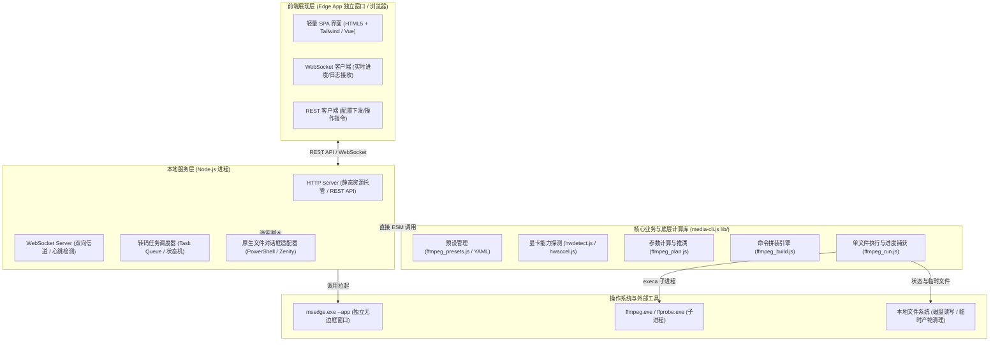

# FFmpeg WebUI 实施方案：本地 Web 服务 + Edge App 独立窗口

> **文档版本**：v1.0.0  
> **创建日期**：2026-09-23  
> **状态**：方案评估与评审阶段  
> **关联命令**：`cmd/cmd_ffmpeg.js`、`lib/ffmpeg_*.js`、`lib/hwdetect.js`

---

## 1. 背景与目标

### 1.1 为什么选择本方案（方案二）
在现有的 `media-cli.js` 体系中，`cmd_ffmpeg.js` 与 `lib/` 已经具备了一套高度完善的音视频处理能力（包含 YAML 预设继承体系、显卡硬件分层矩阵探测、参数智能推演、错误提取与重试、临时文件安全清理）。

如果为了做一个 GUI 而引入 Electron（方案一），会使一个纯粹的 npm CLI 工具额外增加 ~100MB 的 Chromium 内核体积与复杂的打包分发流水线；而如果使用 Tauri/C#（方案三），又会导致业务逻辑需要跨语言重写或维护多层脆弱的子进程通信链路。

**方案二（Local WebUI + Edge App 独立窗口）的核心优势**：
1. **零体积增加**：完全不需要捆绑任何浏览器内核，项目依旧保持轻量纯粹的 Node.js npm 包特性。
2. **免编译运行**：利用 Windows 10/11 系统自带的 Microsoft Edge 浏览器，以 `--app=http://127.0.0.1:<port>` 模式启动。窗口**无地址栏、无标签页、无导航栏**，拥有独立的任务栏图标和窗口控制，在视觉与交互上与原生桌面客户端无异。
3. **100% 同构复用**：后端直接运行在当前的 Node 20+ ESM 环境中，现有 `lib/` 系列模块（预设解析、硬件探测、转码命令构建等）可以直接 `import` 调用，业务逻辑零重复。
4. **灵活扩展**：不仅本机可以作为桌面应用使用，还可以无缝支持在局域网其它设备（如手机、平板、NAS）通过浏览器直接监控转码任务。

### 1.2 核心设计目标
* **开箱即用**：新增子命令 `mediac ui`（或 `node index.js ui`），一条命令即可拉起图形界面。
* **可靠性优先**：转码是长时间高负载任务，必须具备完备的任务取消、子进程强杀、崩溃容错、断点恢复和临时垃圾文件自动清理机制。
* **低侵入性**：不改变现有 CLI 模块的基本行为，仅在底层执行器中增加轻量的事件回调钩子。

---

## 2. 系统总体架构与流程设计

### 2.1 整体架构图



### 2.2 数据流与核心流程

1. **环境与配置初始化**：
   - 启动本地 Node 服务，绑定 `127.0.0.1` 随机空闲端口。
   - 调用 `detectHardwareCapabilities()` 探测当前主机硬件能力（NVENC / QSV / AMF / CPU 等）。
   - 调用 `presets.initPresetsAsync()` 加载全部 YAML 预设。
   - 检测本机 Edge 路径，执行 `msedge.exe --app=http://127.0.0.1:<port>` 开启窗口。
2. **文件选择与任务编排（Plan 阶段）**：
   - 用户在 UI 点击“选择文件/目录”，服务端触发系统原生弹窗，返回选中的真实物理绝对路径。
   - 前端配置输出格式、预设、码率、动漫调优模式等参数，向后端发送 `/api/plan` 请求。
   - 后端调用 `prepareFFmpegCmd` 解析待转码文件信息（时长、编码、分辨率等），生成待转码任务清单与命令预览，返回前端展示。
3. **转码执行与实时推流（Run 阶段）**：
   - 用户确认并点击“开始转码”，向后端发送 `/api/run`。
   - 后端任务调度器启动队列执行，底层 `ffmpeg_run.js` 解析子进程标准输出中的 `out_time`、`speed`。
   - 进度数据通过 WebSocket 实时推送到前端，UI 同步刷新百分比、处理速度、剩余时间与动态日志。
4. **任务完成或中断（Clean 阶段）**：
   - 用户点击“取消”或任务自然完成，触发对应的子进程安全退出。
   - 自动验证产物完整性，清理 `_tmp@hash@tmp_` 临时文件并输出执行统计。

---

## 3. 关键技术难点与工程应对方案

构建此类本地 WebUI 时，常见以下几个可能遇到的棘手问题。本方案针对每个问题提供了切实可靠的工程解法：

### 难点 1：普通浏览器沙箱无法直接获取本地文件的绝对路径
* **问题痛点**：
  在常规网页中，出于浏览器安全沙箱限制，使用 `<input type="file">` 无法拿到文件在磁盘上的真实路径（路径会被强制篡改为空或 `C:\fakepath\test.mp4`），拖拽获取的 `File` 对象也拿不到系统盘符路径。没有绝对路径，后端 `ffmpeg` 就根本无法读取源文件。
* **工程解决方案**：
  采用**“系统原生对话框服务 + 路径拖拽/剪贴板双保险”**方案：
  1. **主选方案：后端代理调用系统原生弹窗**：
     前端的“添加文件”、“添加目录”、“选择输出路径”按钮不绑定 HTML 文件输入框，而是触发向后端的 API 请求 `/api/dialog/open`。后端使用轻量子进程执行系统原生对话框：
     - **Windows（主力）**：通过 PowerShell 调用 .NET 原生 `OpenFileDialog` 或 `FolderBrowserDialog`，仅需几十毫秒即可弹出用户最熟悉的 Windows 原生资源管理器选择界面，选定后将选中的完整物理路径（支持带空格、特殊符号、UNC 路径）直接作为 JSON 返回前端。
       ```powershell
       Add-Type -AssemblyName System.Windows.Forms
       $f = New-Object System.Windows.Forms.OpenFileDialog
       $f.Multiselect = $true
       $f.Filter = "Media Files|*.mp4;*.mkv;*.mov;*.flv;*.avi;*.ts;*.webm;*.mp3;*.m4a;*.flac;*.wav|All Files|*.*"
       if ($f.ShowDialog() -eq [System.Windows.Forms.DialogResult]::OK) {
           $f.FileNames | ForEach-Object { Write-Output $_ }
       }
       ```
     - **macOS / Linux（扩展兼顾）**：分别通过 `osascript` 或 `zenity` 弹窗。
  2. **备选方案：路径直接粘贴与简易路径联想**：
     界面提供文本输入框与“从剪贴板粘贴路径”按钮；同时提供后端路径自动补全 API `/api/fs/suggest?path=...`，用户手动输入盘符（如 `D:\Movies\`）时自动提示子文件夹。

---

### 难点 2：现有 CLI 模块（inquirer/cli-progress）的解耦与代码复用
* **问题痛点**：
  当前 `cmd_ffmpeg.js` 是面向终端设计的，里面直接包含了 `confirmDangerousAction`（调用 inquirer 进行交互式终端问答）、`cli-progress`（在终端屏幕光标处画字符进度条）以及大量的控制台 `chalk` 彩色打印。若在 Web 服务中直接调用该文件，会导致进程阻塞在终端输入或报错。
* **工程解决方案**：
  **不破坏现有 CLI，对底层执行器做最小非侵入性事件抽象**：
  1. `lib/ffmpeg_plan.js`、`lib/ffmpeg_build.js`、`lib/ffmpeg_presets.js`、`lib/hwdetect.js` 本身已经是纯计算/逻辑模块，无终端交互，Web 服务**直接原样复用**。
  2. 针对 `lib/ffmpeg_run.js` 中的 `runFFmpegCmd` 和 `executeFFmpeg`，增加可选的回调函数注入接口：
     ```javascript
     // 现有签名：
     async function runFFmpegCmd(entry, options = {})
     
     // 扩展 options 参数：
     // - showBar: boolean (原终端进度条)
     // - onProgress: Function ({ percent, speed, currentTime, totalTime, fps }) => void
     // - onLog: Function (level, message) => void
     // - signal: AbortSignal (支持外部取消控制器)
     ```
  3. 当以 CLI 执行时，保留原有终端行为；当以 WebUI 执行时，传入 `onProgress` 和 `onLog` 回调，将实时状态转推到 WebSocket。两套界面共享同一套核心转码调度逻辑。

---

### 难点 3：重型任务的中断、取消与临时文件可靠清理
* **问题痛点**：
  转码任务通常持续数分钟至数小时。如果用户在界面点击“停止/取消”，或者不小心直接把 Edge 窗口关闭了，如果处理不当，后台可能留下一个持续满载运行的僵尸 `ffmpeg.exe` 进程，且在目标目录遗留未完成的 `_tmp@hash@tmp_` 垃圾文件。
* **工程解决方案**：
  1. **任务粒度的 AbortController 绑定**：
     每个执行任务在后端均生成唯一的 `taskId`，并持有独立的 `AbortController`。前端发送 `/api/task/stop` 时，服务端立刻调用 `controller.abort()`。
  2. **进程树级终止（Kill Process Tree）**：
     底层 `execa` 启动 ffmpeg 时开启 `cleanup: true` 与 `forceKillAfterDelay: 1000`。在收到 abort 信号时，使用 Windows 原生的 `taskkill /pid <PID> /T /F` 确保 ffmpeg 及其可能派生的子进程被彻底杀灭。
  3. **复用已有的临时文件清理钩子**：
     直接接入 `lib/ffmpeg_run.js` 中现有的 `activeTempFiles` 集合与 `cleanupTempFiles` 机制。一旦任务异常终止或被取消，立刻执行 `fs.removeSync` 清理当前任务的所有临时产物，确保不污染磁盘。

---

### 难点 4：窗口关闭、僵尸服务与服务生命周期自销毁机制
* **问题痛点**：
  如果用户关闭了 Edge 窗口，后台启动的 Node.js Web 服务如果一直默默运行，会导致资源占用甚至阻碍后续再次启动（端口占用）。
* **工程解决方案**：
  引入**“WebSocket 心跳探测 + 优雅空闲退出”**机制：
  1. **窗口连接心跳**：前端通过 WebSocket 每 3 秒向后端发送一次心跳包（Ping/Pong）。
  2. **无客户端检测**：当所有前端连接断开（例如用户直接关掉了 Edge 窗口）：
     - **若当前无转码任务在跑**：启动 10 秒倒计时；若 10 秒内无新窗口重新连入，Node 进程主动退出，干净释放一切端口与资源。
     - **若当前有转码任务正在执行**：不在窗口关闭时强杀任务，而是进入“后台保护状态”（在控制台打印提示），任务跑完或发生错误后自动落盘日志，随后退出。

---

### 难点 5：端口冲突防范与 Edge 浏览器定位兼容
* **问题痛点**：
  - 默认端口（如 3900）可能被其它软件占用，导致服务起不来。
  - 用户电脑上的 Edge 路径可能不在默认的 Program Files 目录下，或者用户使用的是非 Windows 系统。
* **工程解决方案**：
  1. **动态端口探测**：
     服务启动时默认尝试端口 `3900`。若检测到 `EADDRINUSE` 错误，自动递增探测可用端口（`3901`、`3902`...），确保 100% 成功启动。
  2. **多层 Edge 路径定位策略（Windows 平台）**：
     按以下优先级探测 `msedge.exe`：
     - ① 环境变量与注册表路径：读取 `HKLM\SOFTWARE\Microsoft\Windows\CurrentVersion\App Paths\msedge.exe`
     - ② 标准安装目录：
       - `C:\Program Files (x86)\Microsoft\Edge\Application\msedge.exe`
       - `C:\Program Files\Microsoft\Edge\Application\msedge.exe`
       - `%LOCALAPPDATA%\Microsoft\Edge\Application\msedge.exe`
     - ③ 系统 `PATH` 探测：`which("msedge")`
  3. **平滑降级**：
     若未找到 Edge（或在 Linux/macOS 环境下），自动降级为调用系统的默认浏览器打开（如通过 Node 启动默认关联应用），界面体验保持一致，仅缺少无边框 App 壳外观。

---

### 难点 6：本地安全限制（Local Only 安全防线）
* **问题痛点**：
  该 Web 服务具有列出本地磁盘、读取系统文件和执行外部命令的高权限。如果意外绑定到公网 IP 或被局域网内的其它设备利用恶意跨站脚本（CSRF / 跨源 WebSocket 劫持）攻击，可能造成安全隐患。
* **工程解决方案**：
  1. **严格限制监听地址**：HTTP 与 WebSocket 服务**仅监听 `127.0.0.1`**，绝不绑定 `0.0.0.0`（若用户显式通过参数 `--host 0.0.0.0` 开启局域网共享模式除外）。
  2. **随机 Session Token 校验**：服务每次启动随机生成一个一次性 32 位 Token，并在启动 Edge 窗口时以 URL 参数带入（`http://127.0.0.1:port/?token=xxx`）。所有 API 请求与 WebSocket 握手均需校验该 Token，阻断一切恶意的本地跨源请求。

---

### 难点 7：页面刷新与状态持久化
* **问题痛点**：
  在转码进行过程中，用户如果不小心按了 `F5` 刷新页面，或者由于网络波动 WebSocket 重连，界面状态如果重置为空，会导致前端与后端脱节。
* **工程解决方案**：
  1. **服务端单例状态机（Task Queue State Machine）**：
     任务执行状态（任务列表、当前进行到第几个文件、当前文件进度、历史完成情况、近期日志缓冲）全部保存在 Node 内存中的全局单例中。
  2. **连接拉取快照（State Snapshot）**：
     前端每次建立 WebSocket 连接成功后，后端立即主动下发一个 `STATE_SNAPSHOT` 报文，前端瞬间恢复当前正在运行的任务列表、进度条和控制台日志，无缝接续。

---

## 4. 前端交互原型与界面设计

界面采用现代化暗色（Dark Mode）/ 浅色自适应响应式布局，分为四大功能板块：

```
+-----------------------------------------------------------------------------------------+
|  [Logo] mediac ffmpeg Web Studio         [GPU: NVIDIA RTX 4070 (nvenc/qsv)]  [● 状态: 空闲] |
+-----------------------------------------------------------------------------------------+
| [1. 输入与输出配置]                                                                      |
|  源路径: [ C:\Videos\ActionMovies                       ] [浏览文件...] [浏览目录...]     |
|  输出路径: [ 同源目录 (默认)                              ] [选择输出目录...]              |
|  模式: (•) 单目录  ( ) 递归保持目录树   过滤正则: [ shana|.m4a  ]                         |
+-----------------------------------------------------------------------------------------+
| [2. 转码预设与参数微调]                                                                  |
|  预设模板: [ 1080p-fast (通用高质量) ▼ ]   硬件加速: [ 自动 (auto / nvenc) ▼ ]            |
|  视频编码器: [ 自动 / 继承预设 (hevc) ▼ ]   视频质量(CRF): [ 23 ]   分辨率上限: [ 1920 ]   |
|  音频设置: [ 自动复制 (audio-copy) [√] ]   动漫调优模式: [ 开 (保护线条) [√] ]            |
|  [ 更多高级参数 (ffargs / metadata / 严格模式)... ]                                      |
+-----------------------------------------------------------------------------------------+
| [3. 待处理任务清单与命令预览]                        [ 一键分析/生成计划 (Plan) ]          |
|  总文件数: 12 个   |   预估总时长: 04:22:15   |   预估磁盘消耗: ~4.2 GB                   |
|  [清单列表: 01. Episode_01.mkv (1080p H.264 -> HEVC) | 02. Episode_02.mkv ... ]          |
|  [预估底层命令预览: ffmpeg -hwaccel cuda -i ... -c:v hevc_nvenc -cq 23 ...]              |
+-----------------------------------------------------------------------------------------+
| [4. 任务执行与监控看板]                              [ ▶ 开始执行转码 ]  [ ■ 终止任务 ]     |
|  当前处理: [3/12] Episode_03.mkv                                                        |
|  进度条: [████████████████████░░░░░░░░░░░░░░░░░░░░] 42%                                 |
|  转码速率: 3.45x   |   处理帧率: 82 fps   |   已耗时: 00:02:18   |   预计剩余: 00:03:05    |
+-----------------------------------------------------------------------------------------+
| [实时日志终端抽屉 (可折叠)]                                                               |
|  [INFO] FFConv: Initializing hardware encoder: hevc_nvenc...                            |
|  [INFO] FFCMD[HW]: frame=  432 fps= 82.4 q=24.0 size=   12544kB time=00:00:18.00 ...   |
+-----------------------------------------------------------------------------------------+
```

---

## 5. API 接口与 WebSocket 协议规范

### 5.1 REST API 规范

所有 HTTP 请求均采用 JSON 格式，统一前缀 `/api`。

| 路径 | 方法 | 功能描述 | 请求参数示例 | 响应示例 |
| :--- | :--- | :--- | :--- | :--- |
| `/api/system/env` | `GET` | 获取本机环境、显卡与编码器支持信息 | 无 | `{ ok: true, hwCaps: { gpus: [...], encoders: [...] }, presets: [...] }` |
| `/api/dialog/select`| `POST`| 调起系统原生文件/目录选择窗口 | `{ type: "file" \| "directory", multi: true }` | `{ ok: true, paths: ["D:\\Videos\\1.mp4", ...] }` |
| `/api/plan/preview` | `POST`| 扫描路径并生成转码执行计划 | `{ input: "...", preset: "1080p", options: {...} }` | `{ ok: true, tasksCount: 10, totalDuration: 3600, previewCmd: "ffmpeg..." }` |
| `/api/task/start`   | `POST`| 开始执行转码队列 | `{ planId: "..." }` | `{ ok: true, taskId: "task_1727000000" }` |
| `/api/task/stop`    | `POST`| 中断/取消当前正在执行的转码任务 | `{ taskId: "..." }` | `{ ok: true, message: "Task stopped and cleaned." }` |

### 5.2 WebSocket 实时推送协议

客户端连接：`ws://127.0.0.1:<port>/ws?token=<token>`

* **服务端主动推送事件（Server -> Client）**：
  1. **进度更新事件 (`PROGRESS`)**：
     ```json
     {
       "event": "PROGRESS",
       "data": {
         "taskIndex": 2,
         "totalTasks": 10,
         "currentFile": "Episode_02.mkv",
         "percent": 45,
         "speed": "2.8x",
         "currentTime": 254.2,
         "totalTime": 560.0,
         "fps": 68
       }
     }
     ```
  2. **单文件完成事件 (`FILE_DONE`)**：
     ```json
     {
       "event": "FILE_DONE",
       "data": {
         "path": "D:\\Videos\\Episode_01.mp4",
         "srcSize": 1073741824,
         "dstSize": 450000000,
         "duration": 142.5
       }
     }
     ```
  3. **实时日志推送 (`LOG`)**：
     ```json
     {
       "event": "LOG",
       "data": {
         "level": "info",
         "tag": "FFCMD[HW]",
         "text": "frame= 120 fps=60 speed=2.5x ..."
       }
     }
     ```
  4. **全队结束事件 (`ALL_DONE`)**：
     ```json
     {
       "event": "ALL_DONE",
       "data": {
         "total": 10,
         "success": 9,
         "failed": 1,
         "elapsedMs": 350000
       }
     }
     ```

---

## 6. 分步落地实施计划

实施过程划分为 4 个可验证、低风险的阶段：

### 阶段一：内核执行层接口适配（预计耗时极短，改动极小）
- **目标**：在不改变 CLI 现有逻辑的前提下，支持外部监听转码进度。
- **改动范围**：
  - 在 `lib/ffmpeg_run.js` 中，为 `executeFFmpeg` 与 `runFFmpegCmd` 的 `options` 增加 `onProgress`、`onLog`、`signal` 参数。
  - 单测验证：编写自动化测试，验证传入回调时能正确拿到 `percent` 和 `speed`，且中断 `AbortSignal` 时能即时清理临时文件。

### 阶段二：原生对话框与本地服务层搭建
- **目标**：搭建本地轻量 HTTP + WebSocket 服务，完成系统弹窗与核心逻辑对接。
- **改动范围**：
  - 新增 `lib/gui/native_dialog.js`：实现 Windows PowerShell 原生弹窗与多平台兼容。
  - 新增 `lib/gui/server.js`：实现本地 HTTP 服务（极小轻量，基于 Node 原生 `node:http` 或小依赖）、WebSocket 通道、端口防冲突检测与心跳退出。
  - 实现 `/api/system/env`、`/api/dialog/select`、`/api/plan/preview` 和 `/api/task/start` 接口。

### 阶段三：前端轻量界面实现
- **目标**：打造无外部构建包负担的现代化单页控制面板。
- **改动范围**：
  - 静态资源存放在 `assets/webui/` 目录下（单一 `index.html` 配合 CDN 或本地离线 CSS/JS 资源，或者轻量 Vite 打包后的单页产物）。
  - 实现输入输出选择、预设联动选择、参数调节、实时进度仪表盘与折叠日志窗口。

### 阶段四：命令入口集成与联调交付
- **目标**：作为 CLI 的正式子命令接入。
- **改动范围**：
  - 新增命令入口 `cmd/cmd_ui.js`，支持 `mediac ui` 或 `node index.js ui` 启动。
  - 实现 Edge `--app` 的多路径探测与自动启动，以及非 Windows 系统的默认浏览器降级。
  - 编写端到端真实测试，验收实际文件转码、进度刷新、中途取消及异常恢复。

---

## 7. 方案评审与结论

本方案完全立足于当前仓库的 Node.js ESM 现状，既避免了 Electron 带来的庞大体积负担与发布复杂度，又规避了普通浏览器无法读取本地磁盘路径的安全沙箱痛点。通过“Edge App 独立壳 + 原生弹窗代理 + 现有核心库直接复用”的组合拳，能够以最低的开发成本、最小的代码侵入性，交付一个简单直观、极其可靠的图形化多媒体处理界面。
